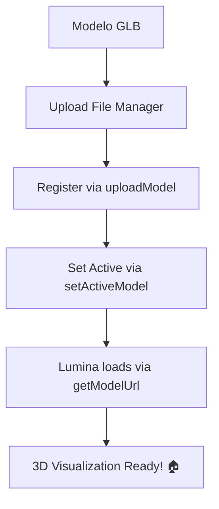

# 🏠 Lumina 3D Model Manager

Driver para gerenciar modelos 3D GLB no Hubitat File Manager, permitindo visualização interativa da casa no dashboard Lumina.

## 📋 Pré-requisitos

- Hubitat Elevation Hub
- Lumina Dashboard v2.0 PRO ou superior
- Modelo GLB da casa (gerado pelo BlenderMCP ou similar)

## 🚀 Instalação

### 1. Instalar o Driver

1. **Acesse Hubitat Web Interface** → `http://your-hub-ip`
2. **Drivers Code** → `Add New Driver`
3. **Cole o código** do arquivo `Lumina-3D-Model-Manager.groovy`
4. **Save** → Driver instalado ✅

### 2. Criar Device Virtual

1. **Devices** → `Add Virtual Device`
2. **Device Name:** `Lumina 3D Model Manager`
3. **Device Network ID:** `lumina-3d-manager` (ou qualquer ID único)
4. **Type:** `Lumina 3D Model Manager` (o driver que você instalou)
5. **Save Device** ✅

### 3. Upload do Modelo GLB

1. **File Manager** → `Upload Files`
2. **Selecione seu modelo GLB** (ex: `casa_principal.glb`)
3. **Upload** → Arquivo fica em `/local/arquivo.glb` ✅

### 4. Configurar Modelo Ativo

1. **Device** → `Lumina 3D Model Manager` → **Commands**
2. **uploadModel** → Digite: `casa_principal.glb` → **Run**
3. **setActiveModel** → Digite: `casa_principal.glb` → **Run**

## ⚙️ Configuração no Lumina

### 1. Obter Device ID

```javascript
// No console do navegador (aba Lumina):
console.log(config.devices); // Encontre o ID do "Lumina 3D Model Manager"
```

### 2. Configurar no Dashboard

1. **Settings** → **3D Model Configuration**
2. **Device ID:** `12345` (ID do device manager)
3. **Model File:** `casa_principal.glb`
4. **Save Configuration** ✅

## 🎮 Comandos do Driver

### uploadModel(fileName)
Registra um modelo GLB no sistema.
```groovy
uploadModel("minha_casa.glb")
```

### setActiveModel(fileName)  
Define qual modelo está ativo para visualização.
```groovy
setActiveModel("minha_casa.glb")
```

### listModels()
Lista todos os modelos disponíveis.
```groovy
listModels()
// Returns: {success: true, models: ["casa1.glb", "casa2.glb"], total: 2}
```

### getModelUrl(fileName)
Retorna a URL completa para carregar o modelo.
```groovy
getModelUrl("casa_principal.glb")
// Returns: {success: true, url: "http://192.168.1.100/local/casa_principal.glb"}
```

### deleteModel(fileName)
Remove modelo do sistema (não deleta arquivo).
```groovy
deleteModel("modelo_antigo.glb")
```

## 🔧 API para Lumina Dashboard

### JavaScript Integration

```javascript
import { getActiveModel, setActiveModel, listModels } from './services/model3dService';

// Obter modelo ativo
const activeModel = await getActiveModel(hubIp, deviceId);
console.log(activeModel); // {success: true, model: "casa.glb", url: "http://..."}

// Listar modelos disponíveis  
const models = await listModels(hubIp, deviceId);
console.log(models); // {success: true, models: [...], total: 3}

// Trocar modelo ativo
await setActiveModel(hubIp, deviceId, "nova_casa.glb");
```

### React Component Example

```jsx
import { getModelUrl } from './services/model3dService';

const HouseViewer3D = ({ hubIp, modelFileName }) => {
  const modelUrl = getModelUrl(hubIp, modelFileName);
  // modelUrl = "http://192.168.1.100/local/casa.glb"
  
  return (
    <Canvas>
      <GLTFLoader url={modelUrl} />
    </Canvas>
  );
};
```

## 📁 Estrutura de Arquivos

```
Hubitat File Manager:
├── casa_principal.glb      (182KB)
├── apartamento.glb         (95KB)
└── escritorio.glb          (67KB)

Driver States:
├── activeModel: "casa_principal.glb"
├── modelList: ["casa_principal.glb", "apartamento.glb", "escritorio.glb"] 
├── totalModels: 3
└── lastUpdated: "15/04/2026 17:45"
```

## 🎯 Workflow Completo



## 🔍 Troubleshooting

### Modelo não carrega
```javascript
// 1. Verificar se arquivo existe
fetch("http://hub-ip/local/modelo.glb").then(r => console.log(r.status));

// 2. Verificar se está registrado
device.listModels(); // Deve aparecer na lista

// 3. Verificar se está ativo
device.getActiveModelInfo(); // Deve retornar o modelo correto
```

### Erro de CORS
✅ **Não acontece!** Driver usa `http://hub-ip/local/` (mesmo domínio que Lumina)

### Device não encontrado
```javascript
// Verificar devices disponíveis
console.log(config.devices.filter(d => d.name.includes("3D Model")));
```

## 📝 Configurações Recomendadas

### Formato GLB
- **Tamanho máximo:** 50MB (recomendado < 10MB)
- **Formato:** GLB v2.0 (binário)
- **Textures:** Embarcadas no GLB
- **Geometria:** Otimizada para web

### Hubitat Settings
```groovy
preferences {
    defaultModel: "casa_principal.glb"     // Modelo padrão
    autoRefresh: true                      // Auto-refresh lista
    debugEnable: false                     // Debug logs
}
```

### Lumina Settings
```javascript
{
  "model3DDeviceId": "123",              // Device ID do manager
  "activeModel3D": "casa_principal.glb", // Modelo ativo
  "hubIp": "192.168.1.100"              // IP do Hubitat
}
```

## 🚀 Features Futuras

- [ ] **Multiple Models:** Alternar entre casa/escritório/garagem
- [ ] **Model Editor:** Interface para ajustar posição de dispositivos  
- [ ] **Auto-Sync:** Upload automático de novos modelos
- [ ] **Backup/Restore:** Backup dos modelos com configurações
- [ ] **Themes:** Diferentes estilos visuais por modelo

## 📞 Suporte

**GitHub:** [Domotika/LuminaDev](https://github.com/Domotika/LuminaDev)
**Branch:** `Claude-Code`
**Arquivos:**
- `hubitat-drivers/Lumina-3D-Model-Manager.groovy`
- `services/model3dService.ts`
- `components/3d/HouseViewer3D.tsx`

---

**🎉 Pronto! Sua casa em 3D interativo no Lumina! 🏠✨**